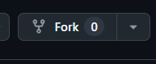
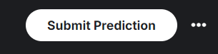
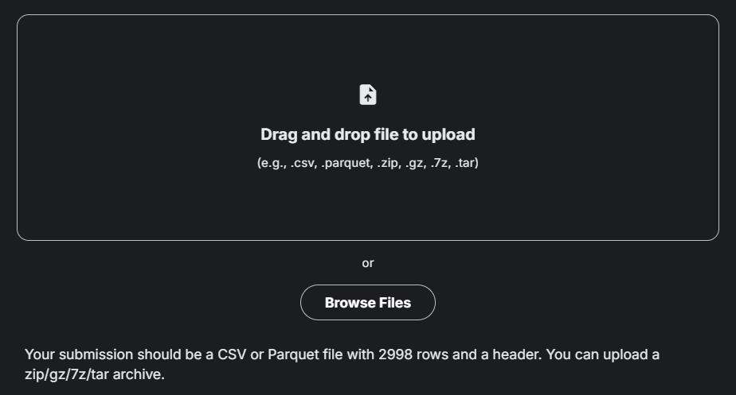
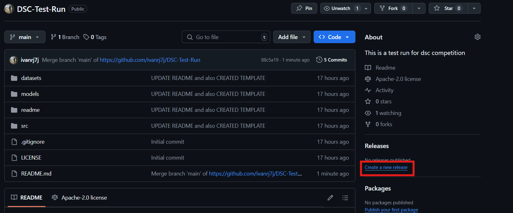
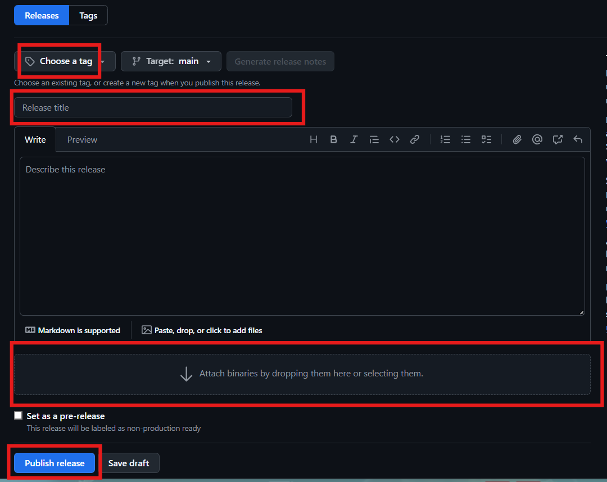

# AI-Generated Image Detection Challenge

## Overview
Welcome to the **AI-Generated Image Detection Challenge**! The goal of this competition is to develop models that can distinguish AI-generated images from real images. Participants are encouraged to experiment with different techniques and submit their best models for evaluation.

This repository is licensed under the **Apache 2.0 License**.

## File Structure
The repository follows this structure:
```
📂 datasets/      # Training and testing datasets (you can also use your own data if you want)
📂 models/        # Saved models and checkpoints
📂 src/           # Source code for training and evaluation
.gitignore        # Ignore unnecessary files
LICENSE          # Apache 2.0 License (do not change)
README.md        # This file (modify this)
```

## Setup Instructions
Follow these steps to set up the project:

### 1. Fork and Clone the Repository
1. Click the **Fork** button on the top right of this repository.

2. Clone your forked repository:
   ```bash
   git clone https://github.com/YOUR_USER_NAME/DSC-Test-Run
   cd DSC-Test-Run
   ```
### 2. Prepare the Dataset
- Download the dataset (provided separately).
- Place it inside the `datasets/` folder.

## Model Training & Evaluation
- Use `src/train.py` to train your model.
- Save trained models inside the `models/` directory.
- You can use formats like `.pth`, `.pt`, `.keras` etc.

## Submission Guide
1. Format your predictions as a CSV file with the following structure:
   
   id|label
   --|---
   0|1
   1|1
   2|0
   ...|...
2. Submit `solution.csv` as your final submission.
    ###### You can see the submit button here
    

    ###### You can upload the csv file here after clicking the submit button.
    

## Releasing Your Model on GitHub (Optional)
If you would like to share your trained model, you can release it on GitHub. Follow these steps:

1. **Save your trained model**  
   - Ensure your model file is inside the `models/` directory.  
   - Recommended formats: `.pth`, `.pt`, `.h5`, `.keras`, etc.

2. **Create a new GitHub Release**  
   - Go to your repository on GitHub.  
   - Click on the **"Releases"** tab.  
   - Click on **"Draft a new release"**.  

3. **Tag your release**  
   - Under **Tag version**, enter a version number (e.g., `v1.0`).  
   - Use **Release title** to briefly describe your model.  

4. **Upload your model file**  
   - Attach your trained model file under the **"Assets"** section.  
   - You can also include additional files, such as logs or configuration files.  

5. **Describe your model**  
   - Write a short summary of your model’s architecture, training settings, and performance in the **release description**.  

6. **Publish the release**  
   - Click **"Publish release"** to make it available for others.  

   ###### Release Tab

   

   ###### Uploading your model and releasing

   

For more details, check [GitHub's official guide on releases](https://docs.github.com/en/repositories/releasing-projects-on-github).

## Evaluation Criteria
Submissions will be evaluated based on the following metrics:
- **F1 Score (highest weight)**
- Accuracy
- Precision
- Recall
- Model simplicity (simpler models preferred)

## Documenting Your Work
We encourage all participants to create a `README.md` file in their own repositories to document their work. Your README should include:
- **Project Overview:** A brief explanation of your approach.
- **Dataset Information:** How you used the provided dataset or any additional datasets.
- **Model Architecture:** Description of your model, including layers and techniques used.
- **Training Process:** Key parameters like batch size, learning rate, and epochs.
- **Evaluation Metrics:** Your model's performance on validation data.
- **Challenges & Improvements:** Any difficulties faced and future improvements.

A well-documented project helps others understand your work and contributes to the learning process for everyone!

## Contributing
We welcome improvements! Feel free to open issues or submit pull requests.

## Contact & Support
For any questions, open an issue or reach out to the organizers.

Good luck and happy coding!